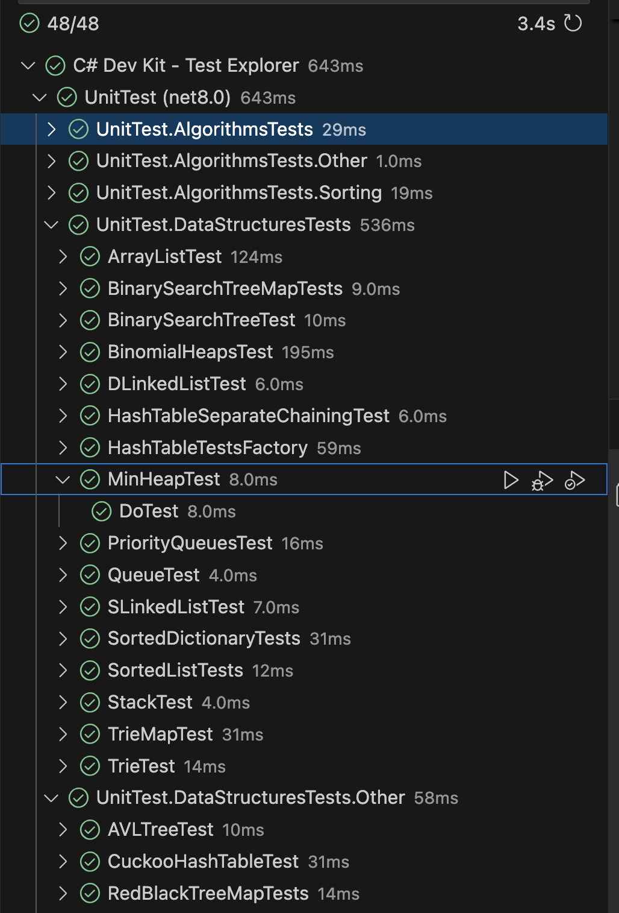

# Лабораторная 1

## Задание 0 (обязательное задание) (5 баллов) - done

-  Установите IDE (Visual Studio Community Edition или Rider)
-  Скачайте и скомпилируйте солюшн: https://github.com/Dimch84/CS-Course/tree/main/AlgorithmsAndDataStructures
- Запустите все юнит-тесты. Все должны отработать корректно. Пришлите скрин с
демонстрацией результатов

### Демонстрация

## Задание 1 (5 баллов) - done

Реализуйте свою хеш-таблицу с разрешением коллизий на основе связных списков.
Можно добавлять, удалять и искать элементы в хеш-таблице

### Solution

Решение находится в папке task1

## Задание 2 (5 баллов) - done

Сгенерируйте пароль для пользователя. Требования: длина от 6 до 20 символов, должен быть
ровно один символ подчеркивания, хотя бы две заглавных буквы, не более 5 цифр, любые две
цифры подряд недопустимы.

### Solution

Решение находится в папке task2

## Задание 3 (5 баллов) - done

Реализуйте стек, в котором есть свойство MinValue, по которому можно получить наименьший
элемент среди всех элементов, находящихся сейчас в стеке.

### Solution

Решение находится в папке task3