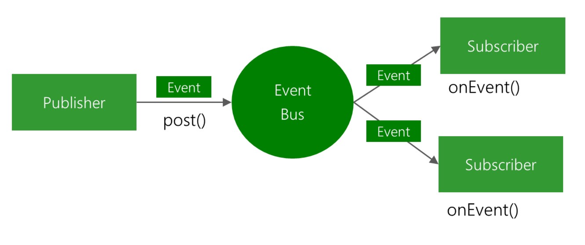

# Лабораторная 4

## Задание 1. Делегаты (3 балла)

Подсчет значения интеграла.

Создайте метод, который возвращает значение интеграла для функции на заданном участке [a,b]. Функция передается через делегат и зависит от единственного параметра x. Сигнатура может быть, например, такой:
```
double Integrate(Function f, double a, double b)
```
Приведите примеры подсчета интеграла для нескольких разных функций.

## Задание 2. Шина событий. Обязательное задание (6 баллов) - done
Реализуйте на основе событий и делегатов шину событий (EventBus): различные классы могут подписываться на события других классов. При возникновении событий, подписавшиеся получают уведомление о том, что событие произошло. Подписаться или отписаться от события можно **только через шину событий**.

В вашем решении должно быть как минимум три класса: Publisher, EventBus и Subscriber. Издателей и подписчиков может быть несколько. При этом должна быть возможность подписывать/отписываться на события отдельных издателей (через шину событий). А шина событий должна быть представлена в единственном экземпляре (по желанию можно использовать паттерн Синглтон)

Идея подобных шин событий в том, что может быть много различных издателей и подписчиков, но все уведомления ходят не напрямую между ними, а через единый объект, которым как раз и является шина событий event bus.

Общая схема работы шины событий изображена на рисунке:


 
## Задание 3. Псевдо-стек (4 балла) - done

Реализуйте следующую структуру данных:

Список (List), состоящий из стеков. У всех стеков есть максимальный допустимый размер, одинаковый для всех стеков. Если стек переполняется, то создается новый стек, который добавляется в List и наоборот (при удалении последнего стек удаляется из списка).

С точки зрения пользователя данная структура должна работать как стек, т.е. должны быть реализованы методы:

`void Push(T value)` – положить «наверх» 

`T Pop()` – взять «верхний» элемент

## Задание 4. Шезлонги (2 балла) - done
Длинный участок пляжа представлен цепочкой из двух символов: 0 - свободен, 1 - занят. Из-за ограничений, связанных с пандемией, новый человек не может занимать место рядом с другим. Между двумя отдыхающими на пляже должно быть одно свободное место. Создайте функцию для вычисления максимального количества новых людей, которые могут поселиться на данном пляже.

Примеры:
- `SunLoungers("10001") ➞ 1` (нового человека можно поместить посередине) 
- `SunLoungers("00101") ➞ 1` (можно разместить слева)
- `SunLoungers("0") ➞ 1`
- `SunLoungers("000") ➞ 2`

## Задача 5. Простые множители (3 балла) - done

Создайте функцию, которая принимает положительное целое число и возвращает строку, описывающую, как число может быть получено путем умножения степени его простых множителей.

Примеры
- `ExpressFactors(2) ➞ "2"`
- `ExpressFactors(4) ➞ "2^2"`
- `ExpressFactors(10) ➞ "2 x 5"`
- `ExpressFactors(60) ➞ "2^2 x 3 x 5"`

Примечания

Все входные данные будут положительными целыми числами в диапазоне $1 < n < 10000$.

Если множитель повторяется, выразите его в форме «x ^ y», где x – множитель (фактор), а y - количество его повторений.

Множители должны появляться в выражении в возрастающем порядке.