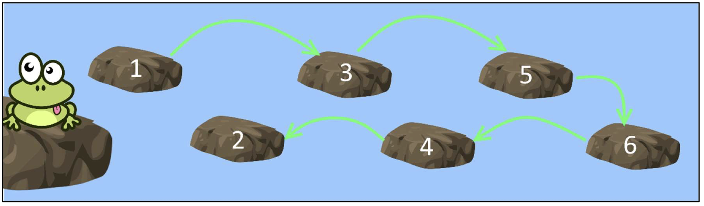

# Лабораторная 5

## Обязательные задания

### Задание 1. Лягушка и озеро (2 балла) - done

Есть крошечная лягушка и озеро, в котором выложена дорожка из камней. У каждого камня есть номер. Лягушка должна пересечь озеро по этому пути, а затем вернуться. Сначала лягушка должна отпрыгать по всем камням с нечетными значениями в порядке их следования в коллекции, а затем по всем четным, но в обратном порядке. Распечатайте порядок камней, в котором прыгала лягушка.

Создайте класс Lake, который содержит все камни в порядке возрастания номеров. Lake реализует интерфейс `IEnumerable<int>` и определяет его метод `GetEnumerator()`.

Примеры:
- + Вход: 1, 2, 3, 4, 5, 6, 7, 8 
  + Выход: 1, 3, 5, 7, 8, 6, 4, 2
- + Вход: 13, 23, 1, -8, 4, 9
  + Выход: 13, 23, 1, 9, 4, -8

### Задание 2. Отсортируйте коллекцию (2 балла) - done

Методы `List<T>.Sort()` и `Array.Sort()` сортируют коллекцию и для определения правила, на основании которого производить сортировку, эти методы принимают `IComparer` в качестве аргумента.

Создайте класс Person, который содержит два свойства: имя и возраст. Создайте два компаратора для Person (классы, реализующие интерфейс `IComparer<Person>`). Первый компаратор должен сравнивать людей на основе длины их имени в качестве первого параметра. Если у двух человек есть имена одинаковой длины, то выполните сравнение без учета регистра на основе первой буквы их имени. Второй компаратор должен сравнивать людей по их возрасту.

Продемонстрируйте работоспособность *каждого* компаратора.

Примечание: подход сортировки на основе компараторов является частным случаем паттерна «Стратегия», когда у вас есть несколько способов выполнить задачу и вы можете выбрать наиболее подходящий, не изменяя реализации основного компонента.

### Задание 3. Свой LinkedList (3 балла) - done

Предложите свою версию связного обобщенного списка `LinkedList<T>`, который реализует интерфейс `IEnumerable<T>`. Список должен также реализовать операции добавления (в конец коллекции) и удаления, должен отображать количество элементов с помощью свойства `Count`. Метод `Remove` должен удалить первое вхождение элемента, начиная с начала коллекции. Если элемент был успешно удален, метод возвращает `true`, иначе `false`.

Продемонстрируйте работоспособность вашего класса на примерах.

## Задания на выбор

### Задание 4. Естественное соединение / Natural Join (4 балла) - done

В реляционных базах данных естественное соединение двух таблиц представляет собой оператор, который принимает две таблицы в качестве входных данных и возвращает новую таблицу, которая объединяет две входные таблицы по их общим ключам. Если входные таблицы отсортированы, соединение просто сканирует две таблицы, записывая записи для перекрестного произведения всех записей с равными ключами.

Например, соединение двух таблиц
| Key | Field1 | Field2 |
| --- | ------ | ------ |
| A   | w      | p      |
| B   | x      | q      |
| B   | y      | r      |
| C   | z      | s      |

и

| Key | Field3 |
| --- | ------ |
| A   | 1      |
| A   | 2      |
| B   | 3      |

— это таблица

| Key | Field1 | Field2 | Field3 |
| --- | ------ | ------ | ------ |
| A   | w      | p      | 1      |
| A   | w      | p      | 2      |
| B   | x      | q      | 3      |
| B   | y      | r      | 3      |

Пусть таблица представлена в виде файла: каждая строка является записью, а поля разделены табуляциями. Для простоты предположим, что первое поле в каждой записи является ключевым (содержит полный ключ записи (строки)).

Напишите программу, которая берет два входных файла, производит их естественное соединение и выводит результат на консоль.

Данные внутри файлов хранятся в неупорядоченном виде (т.е. не обязательно упорядочены по ключу).

### Задание 5. Структура данных для большой разреженной матрицы (4 балла)

Пусть имеется большая разреженная 2- или 3-мерная матрица. Диапазон индексов (по каждому измерению) может достигать нескольких миллионов. Общее количество реально занятых элементов (на всю матрицу) - тысячи, десятки тысяч.

Реализуйте структуру данных, которая позволит иметь возможность быстрого доступа к элементу по индексу (например, a[i][j][k]). С другой стороны, нужна возможность быстро обойти все непустые элементы и что-то с ними сделать (условно говоря, запустить цикл foreach(...)). Скорость очень важна.

Элементом матрицы может быть любой объект. Продемонстрируйте работоспособность вашего решения.

